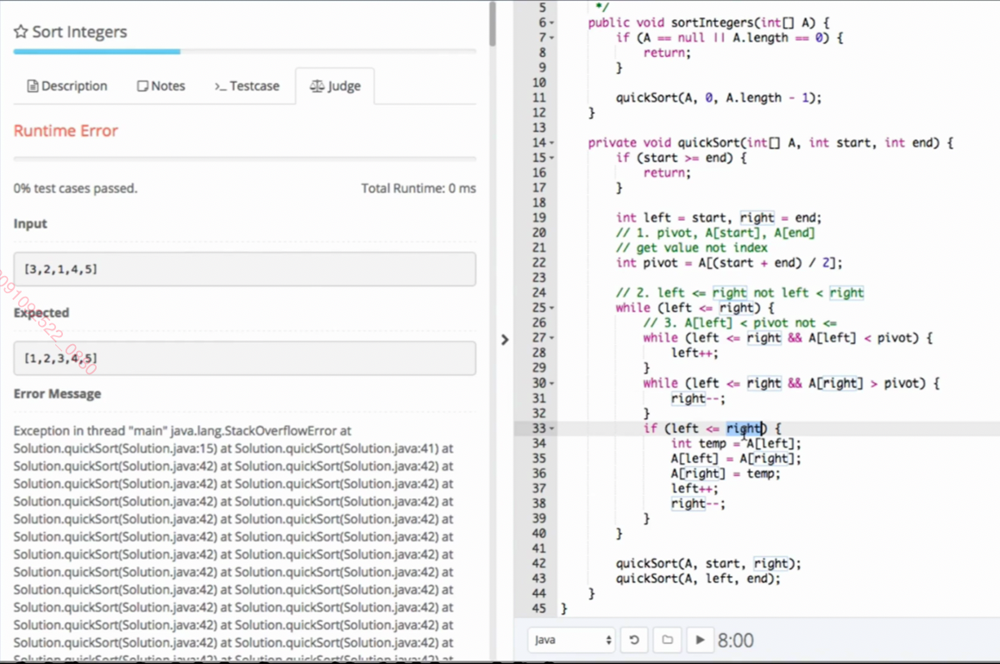
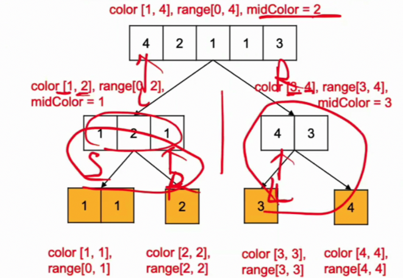
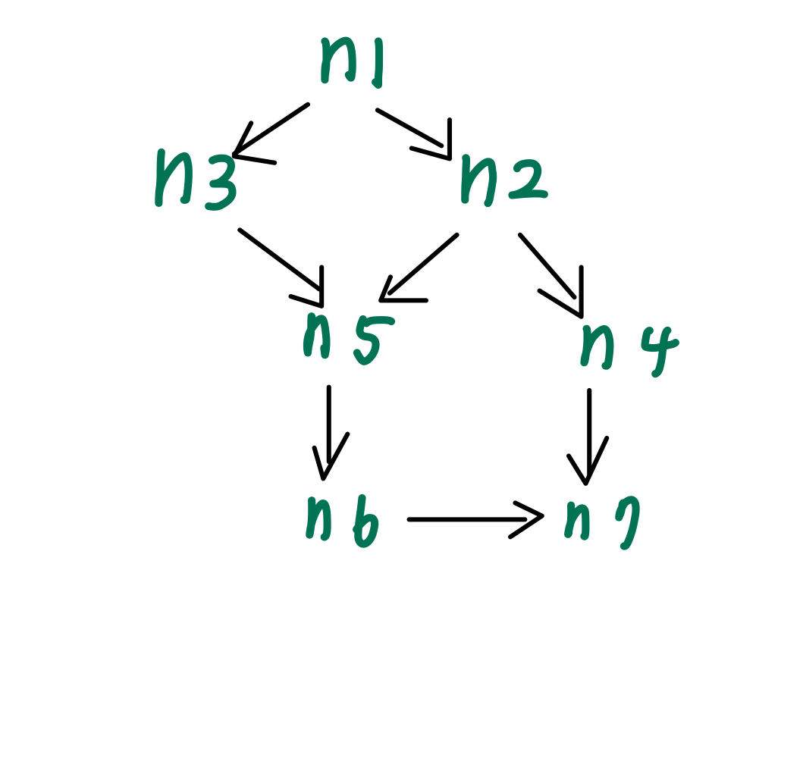
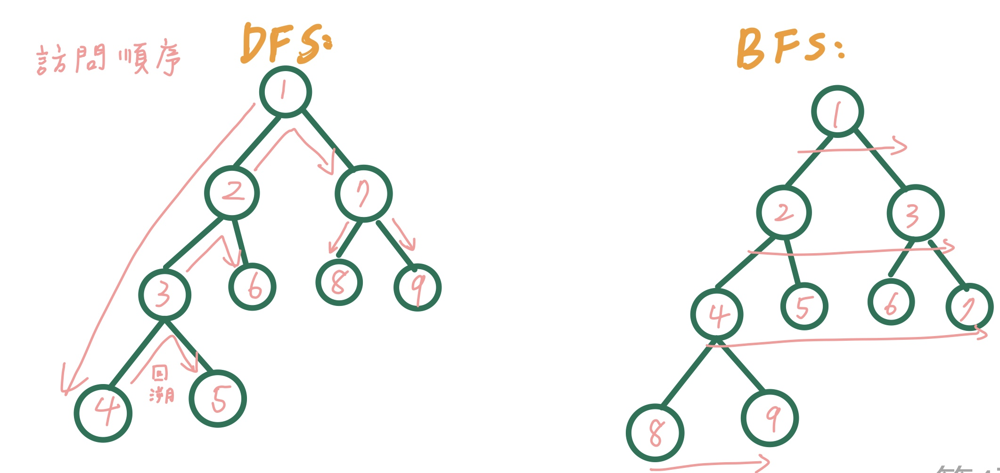
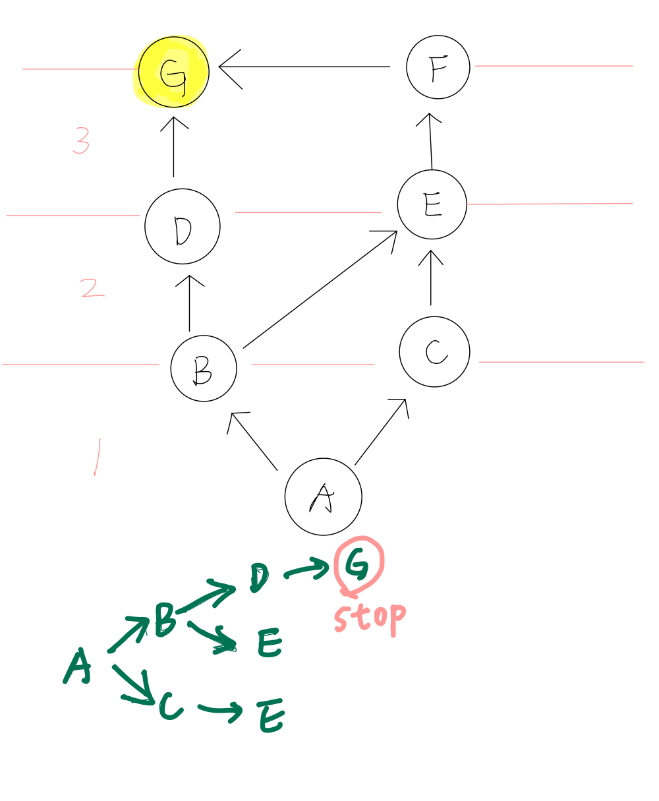

# Leetcode解題思維

## Data Structure
### Hash Table: Dictionary
`{[key1 : value1], [key2 : value2]}`

如何操作
```py
dic = {}
dic[key] = value
```
* dictionary + list：[1133. Largest Unique Number](./Leetcode-Python/1133.py)
* 找某數在list的位置(有和沒有dictionary的方法)：[1. Two Sum](./Leetcode-Python/1.py)

### Set:
* [607. Two Sum III - Data structure design](./Lintcode-Python/607.py)

## Time Complexity and Space Complexity

### Time Complexity:
O(log n): 
1. binary search: 猜數字遊戲並且每次都中間切割
2. heap(queue)先進先出FIFO


## Algorithms
### <span style="color:Coral">Two Pointers 雙指針</span>

* 相向：
Time:O(n)
    1. Reverse: 題目不多
    2. Two Sum(兩位數相關變形題)：[125. Valid Palindrome](./Leetcode-Python/125.py)（判斷是否為回文串、[1. Two Sum](./Leetcode-Python/1.py)、[57. 3Sum](./Lintcode-Python/57.py)、[382. Triangle Count](./Lintcode-Python/382.py)
    3. Partition(兩位數相關變形題)：
```py
left, right = 0, len(s)-1
while left < right :
  判斷進而對left和right做加減
```
* 背向(出題頻率較低)：
    1. 找出最長的回為串: Longest Palindromic Substring 的中心線枚舉算法
    2. 二分法中的Find K Closest Elements
* 同向：
    1. 一個slow pointer，一個fast pointer: [283. Move Zeroes](./Leetcode-Python/283.py)
    2. Sliding Windowc滑動窗口：

```py
slow = 0

for fast in range(len(nums)):
    if fast 找到 and slow 也找到:
        swip之類的
    if slow 沒找到:
        slow += 1
```


### <span style="color:Coral">Quick Sort 快速排序</span>：Divide and Conquer 分而治之

time: O(nlogn) 理想狀態，最壞到O(n^2)
space: O(1)
1. 取中心點 pivot，整體有序再局部遞歸排序
2. left <= right
3. A[left] < pivot

[463. Sort Integers](./Lintcode-Python/463.py)

 


### <span style="color:Coral">Partition</span>：

* [31. Partition Array](./Lintcode-Python/31.py)

 


### <span style="color:Coral">Quick Sort (Partition)</span>：
time: O(NlogK)
space: O(logK)
類似於快速排序，差別在於：quick sort的中間值是<span style="color:green">index/2</span>，partition是 <span style="color:green">組個數/2</span>，用於組的排序/分類，所以時間複雜度為O(NlogK)

顏色分類：
* [143. Sort Colors II](./Lintcode-Python/143.py)
* [正負數交錯](./Lintcode-Python/144.py)


### <span style="color:Coral">Quick Select </span>
time: 
space: 

[5. Kth Largest Element](./Lintcode-Python/5.py), 
[80. Median](./Lintcode-Python/80.py)
```py
    def kth_largest_element(self, k: int, nums: List[int]) -> int:
        n = len(nums)       
        k = 定義k在index的位置，若是算第k大就要用len(nums) - k，若是說k小就要k - 1
        if not nums:
            return -1
        return self.quick_select(nums, 0, n - 1, k)

    def quick_select(self, nums, start, end, k):
        if start == end:
            return nums[start]
        left, right = start, end
        # 一律找出nums的中心點
        mid = nums[(start + end) // 2]
        # 方法跟quick sort很像
        while left <= right:
            # 先把nums[left] < mid都跳過，直到找到nums[left] > mid
            while left <= right and nums[left] < mid:
                left += 1
            # 先把nums[right] > mid都跳過，直到找到nums[right] < mid
            while left <= right and nums[right] > mid:
                right -= 1
            # 把找到的nums[left] > mid和nums[right] < mid對調
            if left <= right:
                nums[left], nums[right] = nums[right], nums[left]
                left += 1
                right -= 1
        # 假如k小在右側就搜索右側的範圍，否則搜索左側
        if k  <= right:
            # index則是從start到right
            # 因爲在最後交換位置後，right-1 left+1，right會跑到left左邊
            return self.quick_select(nums, start, right, k)
        if k  >= left:
            return self.quick_select(nums, left,  end, k)
        return nums[k]
```
### <span style="color:Coral">Merge Sort 歸併排序 </span>
time: O(nlogn), space: O(n)
1. 取中心點 pivot，先局部有序後整體排序
2. 額外空間o(n)的耗費
3. 較穩定的排序
4. 運行模式divide and conquer：先不斷切一半（不斷recursion）完以後，進行merge，在merge過程中排列，比較左右邊然後把小的放進temp的list

* [463. Sort Integers](./Lintcode-Python/463.py)

|             |   time   | space | stable |
| ----------- | -------- | ----- | ------ |
| Quick Sort  | O(nlogn) |   1   |   X    |
| Merge Sort  | O(nlogn) |  O(n) |   O    |


#### Binary Search：Decrease and Conquer 減而治之

二分法：
1. 是在list已經sort的情況下實現 
2. 不使用recursion的解法，用while：時間複雜度：O(logn)
3. 每次搜索的範圍都縮小一半

只要有以下關鍵詞，很有可能是要用binary search
* target, sorted, array

九章模板：
```py
class Solution:
    def binarySearch(self, nums, target):
        if not nums:
            return -1
            
        start, end = 0, len(nums) - 1
        # 用 start + 1 < end 而不是 start < end 的目的是为了避免死循环
        # 在 first position of target 的情况下不会出现死循环
        # 但是在 last position of target 的情况下会出现死循环
        # 样例：nums=[1，1] target = 1
        # 为了统一模板，我们就都采用 start + 1 < end，就保证不会出现死循环
        # 能理解為start和end在隔壁的時候結束循環
        while start + 1 < end:
            # python 没有 overflow 的问题，直接 // 2 就可以了
            mid = (start + end) // 2
            
            # > , =, < 的逻辑先分开写，然后在看看 = 的情况是否能合并到其他分支里
            if nums[mid] < target:
                # 代表target在mid的右邊，所以把start point設為mid
                # 写作 start = mid + 1 也是正确的
                # 只是可以偷懒不写，因为不写也没问题，不会影响时间复杂度
                # 不写的好处是，万一你不小心写成了 mid - 1 你就错了
                start = mid
            elif nums[mid] == target:
                # 如果是first position則是end=mid, 如果是last position則是start=mid
                end = mid
            else: 
                # 代表target在mid的左邊，所以把end  point設為mid
                # 写作 end = mid - 1 也是正确的
                # 只是可以偷懒不写，因为不写也没问题，不会影响时间复杂度
                # 不写的好处是，万一你不小心写成了 mid + 1 你就错了
                end = mid
                
        # 因为上面的循环退出条件是 start + 1 < end
        # 因此这里循环结束的时候，start 和 end 的关系是相邻关系（1和2，3和4这种）
        # 因此需要再单独判断 start 和 end 这两个数谁是我们要的答案
        # 如果是找 first position of target 就先看 start，否则就先看 end
        if nums[start] == target:
            return start
        if nums[end] == target:
            return end
        
        return -1
```
使用模板就方便很多：
* [457. Classical Binary Search](./Lintcode-Python/457.py)
* 找最後一個出現的target(有重複值): [458. Last Position of Target](./Lintcode-Python/458.py)
* 找第一個出現的target(有重複值): [14. First Position of Target](./Lintcode-Python/14.py)
* 變化題：[447. Search in a Big Sorted Array](./Lintcode-Python/447.py)
* 變化題：[460. Find K Closest Elements](./Lintcode-Python/460.py)
* matrix兩個binary search、二維轉化成一維（兩種解）  ：[28. Search a 2D Matrix](./Lintcode-Python/28.py)
* 找山頂，數據是漸大再漸小(沒有重複值): [585. Maximum Number in Mountain Sequence](./Lintcode-Python/585.py)
* 有很多山峰，找任一山峰：[75. Find Peak Element](./Lintcode-Python/75.py)
* 找起點最小值，數據是漸大再斷層再漸大(沒有重複值): [159. Find Minimum in Rotated Sorted Array](./Lintcode-Python/159.py)
* 高頻題：數據和159題一樣，只是這次找target instead of minimum: [62. Search in Rotated Sorted Array](./Lintcode-Python/62.py)
* 難題：切割長度不等的木頭，找木頭的最大長度: [183. Wood Cut](./Lintcode-Python/183.py)

### <span style="color:Coral">Breadth First Search</span>
拿來找最短路徑的演算法

  

```py
d = [0]* 8    #d是存到從start到自己的距離 array8個位置從0開始
q = []        #q是存目前要拜訪得節點
visited = set()
q.append(n1)
visited.add(n1)
while q:
    head = q[0]
    print('name: ', head.name)
    if head == n7:
        return d[7]
    len_q = len(q)
    q.pop(0)
    for k in range(len_q):
        for i in head.neighbor:
            if i not in visited:
                q.append(i)
                visited.add(i)
                d[i.name] = d[head.name] +1
```

* [bfs的基本練習](./bfs/bfs.ipynb)
* 有單隊列、雙隊列、DummyNode的解法：[69. Binary Tree Level Order Traversal](./Lintcode-Python/69.py)

  

### <span style="color:Coral">Depth First Search</span>
1. 可以用recursion實現
2. 也可以不用遞歸函數，自己通過一個手動創建的stack進行操作
3. 一定會使用到backtracking，到最深層的之後，會回朔到上一層 

<span style="color:IndianRed">遍歷法(Traversal)和分治法(Divide and Conquer):</span>

遍歷法: 親力親為，拿著一個記事本走片所有節點 
1. 先序遍歷pre-order
2. 中序遍歷in-order：請把第二種解法背起來：[86. Binary Search Tree Iterator](./Lintcode-Python/86.py)
3. 後序遍歷post-order

把中序遍歷背起來：
```py
class BSTIterator:
    """
    @param: root: The root of binary tree.
    """
    def __init__(self, root):
        # do intialization if necessary
        self.stack = []
        # root非空就要一直往左子樹下挖
        self.find_most_left(root)

    def find_most_left(self, node):
        while node:
            self.stack.append(node)
            node = node.left
    
    """
    @return: True if there has next node, or false
    """
    def hasNext(self):
        # 當stack為空，表示沒有next node
        return bool(self.stack)
    """
    @return: return next node
    """
    def _next(self):
        # 直接pop
        node = self.stack.pop
        # 若右子數非空
        if node.right:
            self.find_most_left(node.right)
        return node
```


分治法: 分配小弟去做子任務，自己金行結果匯總

* [480. Binary Tree Paths](./Lintcode-Python/480.py)

Binary Tree的分治法模板：

```py
def divideConquer(self, root):
    if not root:
        return
    '''
    if not root.left and not root.right:
        處理到底了，葉子應該返回的結果
        如果葉子的返回結果可以通過兩個空節點的返回中得到
        就可以省略這段
    '''   

    左子葉返回結果 = divideConquer(root.left)
    右子葉返回結果 = divideConquer(root.right)
    整棵樹的結果 = 按照一定方法合併左右子葉的結果

    return 整棵樹的結果
```


### <span style="color:Coral">Recursion</span>
遞歸四要素
1. 遞歸的定義
2. 遞歸的分解
3. 遞歸的出口
4. call自己

```py
def a(n):
    if (遞歸的出口): 
        return
    分解通常都砍半之類的
    做要做的事
    # 回call function
    self.a(n)    
  return 需要的答案
```
  

* [binary tree(preorder + recursion)](./Leetcode-Python/104.py)  
* [Fibonacci number(滾動數組優化)](./Leetcode-Python/509.py)
* [Classical Binary Search](./Lintcode-Python/457.py)
* [480. Binary Tree Paths](./Lintcode-Python/480.py)