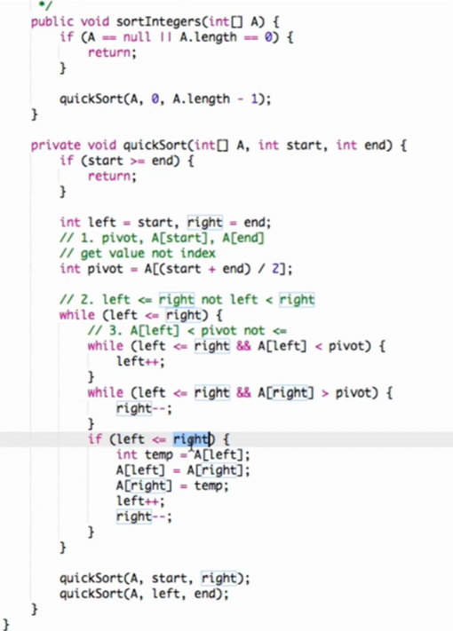

# Leetcode解題思維

## Data Structure
### Hash Table: Dictionary
`{[key1 : value1], [key2 : value2]}`

如何操作
```py
dic = {}
dic[key] = value
```
* dictionary + list：[1133. Largest Unique Number](./Leetcode-Python/1133.py)
* 找某數在list的位置(有和沒有dictionary的方法)：[1. Two Sum](./Leetcode-Python/1.py)

## Time Complexity and Space Complexity
### Time Complexity:
O(log n): 
1. binary search: 猜數字遊戲並且每次都中間切割
2. heap(queue)先進先出FIFO

## Algorithms
### Two Pointers 雙指針
* 相向：[125. Valid Palindrome](./Leetcode-Python/125.py)（判斷是否為回文串）, [1. Two Sum](./Leetcode-Python/1.py)
* 背向(出題頻率較低)：找出最長的回為串 longest substring
```py
left, right = 0, len(s)-1
while left < right :
  判斷進而對left和right做加減
```
### Quick Sort 快速排序 
time: O(nlogn) 理想狀態，最壞到O(n^2)
space: O(1)
1. 取中心點 pivot，整體有序再局部遞歸排序
2. left <= right
3. A[left] < pivot

[463. Sort Integers](./Lintcode-Python/463.py)

 

### Quick Select 
time: 
space: 

[5. Kth Largest Element](./Lintcode-Python/5.py), 
[80. Median](./Lintcode-Python/80.py)
```py
    def kth_largest_element(self, k: int, nums: List[int]) -> int:
        n = len(nums)       
        k = 定義k在index的位置，若是算k大就要用len(n) - k，若是說k小就要k - 1
        if not nums:
            return -1
        return self.quick_select(nums, 0, n - 1, k)

    def quick_select(self, nums, start, end, k):
        if start == end:
            return nums[start]
        left, right = start, end
        # 一律找出nums的中心點
        mid = nums[(start + end) // 2]
        # 方法跟quick sort很像
        while left <= right:
            # 先把nums[left] < mid都跳過，直到找到nums[left] > mid
            while left <= right and nums[left] < mid:
                left += 1
            # 先把nums[right] > mid都跳過，直到找到nums[right] < mid
            while left <= right and nums[right] > mid:
                right -= 1
            # 把找到的nums[left] > mid和nums[right] < mid對調
            if left <= right:
                nums[left], nums[right] = nums[right], nums[left]
                left += 1
                right -= 1
        # 假如k小在右側就搜索右側的範圍，否則搜索左側
        if k  <= right:
            return self.quick_select(nums, start, right, k)
        if k  >= left:
            return self.quick_select(nums, left,  end, k)
        return nums[k]
```
### Merge Sort 歸併排序 
time: O(nlogn), space: O(n)
1. 取中心點 pivot，先局部有序後整體排序
2. 額外空間o(n)的耗費
3. 較穩定的排序
4. 運行模式divide and conquer：先不斷切一半（不斷recursion）完以後，進行merge，在merge過程中排列，比較左右邊然後把小的放進temp的list


|             |   time   | space | stable |
| ----------- | -------- | ----- | ------ |
| Quick Sort  | O(nlogn) |   1   |   X    |
| Merge Sort  | O(nlogn) |  O(n) |   O    |
### Recursion
1. if return 最基本的case
2. call function 
3. return 需要的答案
```py
def a(n):
  if (base case): 
    return
  要做什麼事 = a()
  return 需要的答案
```
  

* [binary tree(preorder + recursion)](./Leetcode-Python/104.py)  
* [Fibonacci number(滾動數組優化)](./Leetcode-Python/509.py)  

### Breadth First Search
拿來找最短路徑的演算法  
  
```py
d = [0]* 8    #d是存到從start到自己的距離 array8個位置從0開始
q = []        #q是存目前要拜訪得節點
visited = set()
q.append(n1)
visited.add(n1)
while q:
    head = q[0]
    print('name: ', head.name)
    if head == n7:
        return d[7]
    len_q = len(q)
    q.pop(0)
    for k in range(len_q):
        for i in head.neighbor:
            if i not in visited:
                q.append(i)
                visited.add(i)
                d[i.name] = d[head.name] +1
```
* [bfs的基本練習](./bfs/bfs.ipynb)
